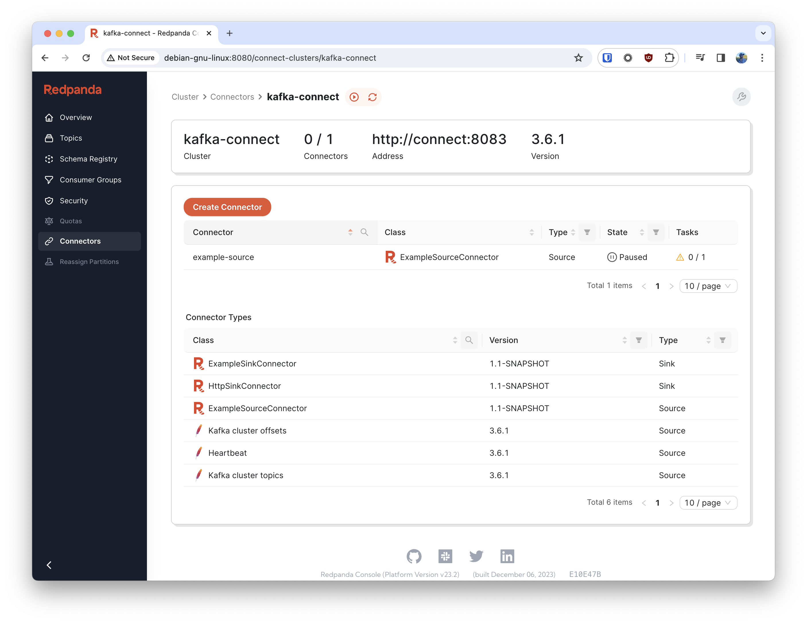
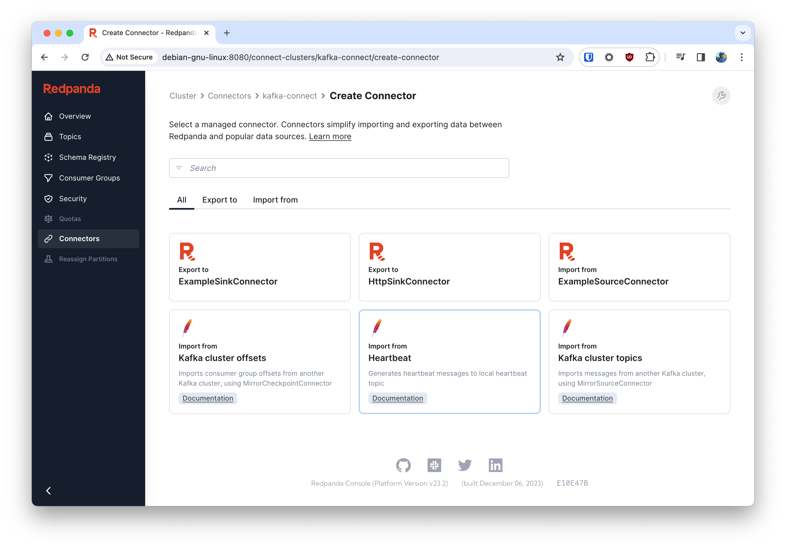

# Kafka Connect Source & Sink Example



## Requirements
- Java 11 or maybe 17 (tested with 11)
- Docker Compose

## Instructions
1. Build the jar:
```
$ ./gradlew jar
```
2. Launch the services:
``` 
$ docker-compose up
```
3. Open Redpanda Console and Play Around: 
> http://localhost:8080/connect-clusters/kafka-connect

At this point you should be able to see the example connectors in the UI:



## Sample PostgreSQL Database
A sample PostgreSQL database is provided thanks to the Debezium project if you want to play with it as a source or sink.

It's accessible via the Connect service at `postgres:5432` with a database called `postgres` and a username/password
of `postgres:postgres`. (Think you can remember that? 😜)

## ⚠️ Heads Up!
The dummy source connector will rapidly fill a target topic with garbage data 😬
